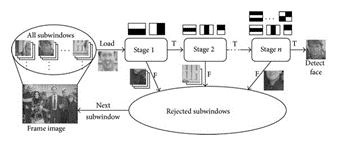
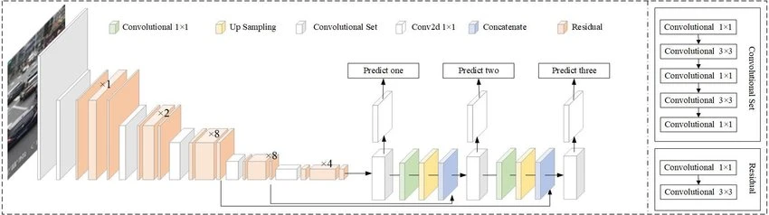
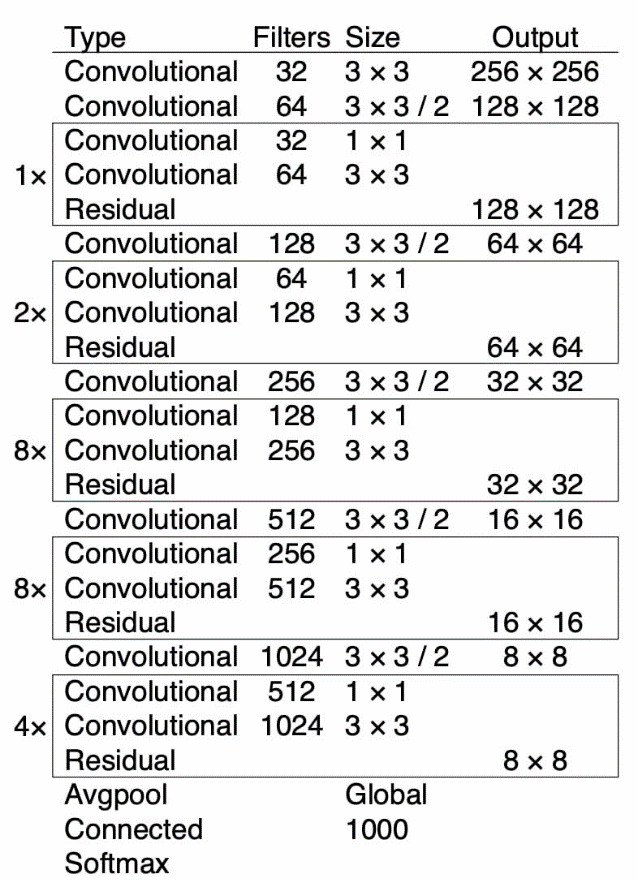
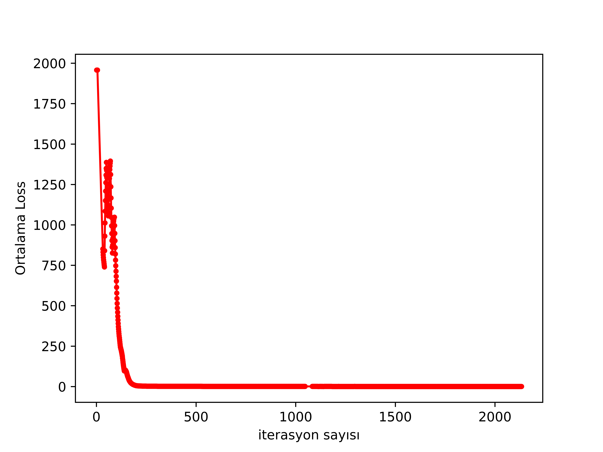

CNN Kullanılarak Görüntü Üstünde Ateş Tespiti

Belit B. Kış ,

+----------------------------------------------------------------------+
| **Citation:** Kış, B.B. CNN Kullanılarak Görüntü Üstünde Ateş        |
| Tespiti. **2021**, *21*, x.                                          |
|                                                                      |
| Academic Editor: Firstname Lastname                                  |
|                                                                      |
| Received: date                                                       |
|                                                                      |
| Accepted: date                                                       |
|                                                                      |
| Published: date                                                      |
+----------------------------------------------------------------------+

\* Bağlantı 1; belitberdelk\@hotmail.com

\* Haberleşme: belitberdelk\@hotmail.com

**Öz:** Bu doküman 18 mayıs Makine Öğrenmesi dersi projesi için
hazırlanmış yazılı raporu içermektedir. Rapor CNN kullanılarak verilen
görsel üstünde yangın tespiti yapıp işaretlenmesi ve tanımlama işleminin
uygulanmasını içermektedir. Bulunan veriler ile hızlı ve doğruluk oranı
yüksek bir nesne tanımlama makinası oluşturulup gerçek hayatta
uygulanabilirliği sunulmaktadır. Bu makalede doğal afet sayılan orman
yangınlarına karşı CNN kullanılarak bir yangın algılayıcı geliştirilerek
can ve mal kaybını önlemeye yönelik geliştirilen proje anlatılmaktadır.

**Anahtar Kelimeler:** CNN, nesne tanımla

1\. Giriş

Dünya nüfusunun son 100 yılda katlanarak artması sonucu, ormanlar
üzerindeki baskı, şimdiye kadar hiç olmadığı kadar büyük bir düzeye
ulaşmıştır. Bu baskı, ormanlar üzerinde en yoğun olarak; açmacılık,
kesimler ve de orman yangınları şeklinde gerçekleşmektedir. Günümüzde
dünya üzerinde 4 milyar hektar orman bulunmaktadır. Çeşitli nedenlerle
1950-1990 yılları arasında mevcut ormanların yarısı tahrip olmuştur.
Ülkemizde de son 10 yıl içerisinde 12.000 hektar ormanımız yanarak yok
olmuştur. Günümüzde gelişen teknoloji ve bu teknolojinin orman
yangınlarına karşı yoğun olarak kullanılmasına rağmen orman yangınları
hala büyük bir tehlike olarak durmaktadır. Yangınlarla savaşta bilimin
ve diğer imkanların insanoğlunun yanında olmasına karşın, gün geçtikçe
ekstrem koşullara bürünen iklim şartları, hızla artan dünya nüfusu ve bu
nüfusun beslenme, barınma gibi ihtiyaçlarına ek olarak, değerli alanlara
olan yoğun göç terazinin öteki kefesinde yer almaktadır \[1\].

Afetlerin ulaşım, enerji, iletişim, altyapı, sanayi gibi sistemlere olan
etkileri birincil (doğrudan ve dolaylı) etkileridir. İkincil etkiler ise
makroekonomik, yani ülke ekonomisine olan etkileridir. İkincil etkiler,
afetten bir süre sonra meydana gelir ve büyüme ve istihdam düzeylerine,
fiyatlar genel düzeyine, ödemeler dengesine olan etkileri ile ilgilidir.
İktisadi büyüme, enflasyon oranları, bütçe açığı, kamu harcamaları, borç
dengesindeki bozulmalar ikincil ekonomik etkilerdir \[2\].

Türkiye orman ve yaban hayatı açısından oldukça zengin bir ülkedir.
Ancak bu fauna zenginliği de diğer tüm doğal bileşenler gibi yoğun baskı
altındadır. 1937 yılından 2009 yılına kadar geçen 73 yıllık dönemde
çıkan 86.769 adet orman yangınında toplam 1.617.701 hektar alanın
yanması orman ve yaban hayatı varlığımızın ne kadar hızlı azaldığının
önemli bir göstergesidir. Ülkemizde Temmuz ve Eylül ayları arası
tehlikeli yangın sezonu olarak kabul edilmektedir ve bu dönemde çıkan
yangın adedi ve büyüklükleri de fazladır. Bu dönemin kuşları üreme ve
kuluçka dönemine, memelilerin ise yavru bakım dönemine denk gelmesi
orman yangınlarının yaban hayatı üzerine olan tehlikeli etkisini daha da
arttırmaktadır \[3\].

Artan sediment akışını takiben yangın suyun ekolojik sağlığını ve içme
suyu işletmesini etkiler. Yangın sonrası sedimentlerin büyük bir kısmı
amfibiler ve balıklar, böcekler gibi sudayaşayan diğer canlılar için
uygun biyolojik habitatı oluşturur. Büyük yangın sonrası sedimentler
içme suyu sistemlerindeki etkiyi iki şekilde arttırır. İlk ve en önemli
olarak rezervuarların, infiltrasyon havzalarının ve bakım çalışmalarının
dolması, zarar görmesi ya da sediment tarafından bozulmasıdır. İkinci
olarak ise, artan sediment birikimi neticesinde mevcut sedimentin
ortamdan kaldırılması için gereken uygulamalar ve maliyetlerin artması
olarak karşımıza çıkmaktadır \[4\].

> Orman yangını, doğal ya da insani sebeplerden ortaya çıkan yangınların
> ormanları kısmen veya tamamen yakmasıdır. Yıldırım düşmesi yanardağ
> patlaması ve yüksek sıcaklık gibi doğal sebeplerle çıkan yangınlar ve
> sigara, tarımsal ürünler nedenli çıkan insan kaynaklı orman yangınları
> vardır. Ormanların yanması ekolojik olarak birçok zarara sebep olur.
> İklim değişikliği ve kuraklık başlıca sonuçlardır. \[5\]
>
> Gelişen teknoloji ile evrişimli sinir ağları az kaynak kullanarak daha
> hızlı çalışabilmektedir. Nesne algılama bilgisayar görüsü ve görüntü
> işleme kullanılarak belirli bir sınıfın anlamlı nesnelerinin video
> veya fotoğraf üstünde tespit edilmesidir. Nesne tanımlama genel olarak
> yüz ve aktivite tanımlama gibi alanlarda kullanılır. Yolo, R-CNN ve
> SSD sinir ağı yaklaşımları olarak örnek verilebilir. Haar ve HOG
> makine öğrenmesi örnekleridir.

Şekil-1: Haar özellik yapısı

Projede nesne algılama algoritması olarak YOLO \[6\] seçilmiştir. YOLO
(You Only Look Once) algoritması tek aşamalı olup evrişimli sinir ağları
ile yapılandırılmış veri dizileri arasındaki kalıpları tanımlayarak
çalışmaktadır. Görüntü girdisini NxN bölgelere ayırır, her bölge
sınırlayıcı kutuyu ve kutu içindeki obje için güveni tahmin eder. Tahmin
edilen güven sınırlayıcı kutunun doğruluğu ile orantılıdır.

Şekil-2 : YOLO yapısı

2\. Materyal ve Yöntem

Bu araştırmada kullanılan materyaller bu başlık altında kullanılan veri
seti ve yangın fotoğrafları olarak detaylandırılarak anlatılacaktır.
YOLO eğitimi için internette çeşitli kaynaklardan toplanmış olan 755
tane orman yangını içeren fotoğraf kullanılmıştır. Öznel veri sayısı
önerilen sayıdan az olduğu için öznel fotoğraflar üzerinden belirli
parametreler ile modifiye ederek toplamda 1154 tane fotoğraf verisi elde
edilmiştir. Bu veri setleri proje için oluşturulmuş ve kullanılmıştır.

Projede amaç yangınlarda görüntü üzerinden sınırlayıcı bölge oluşturmak
ve belirleme yapmak olduğu için veri setleri ikinci aşamaya geçilmiştir.
YOLO eğitimi için gerekli olan fotoğraf ve fotoğraf içinde tespit
edilmesi istenilen objenin sınırlayıcı kutu koordinatları gerekmektedir.
Fotoğraflar veri seti üzerinde LabelImg \[7\] uygulaması kullanılarak
YOLO formatına uygun koordinat veri seti oluşturulmuştur.

Eğitim Yöntemi olarak özellikle az veri ile yüksek performans sağlanması
için YOLOv3 uyumlu Darknet-53 ağı kullanmaktadır. Darknet-53 53 katmanlı
artık ve evrişimli katmanlar kullanılarak oluşturulmuş önceden eğitimli
bir CNN'dir.

Şekil-3: Darknet-53 Yapısı

Darknet altyapısı kullanılarak Darknet-53 ağı 420x420 boyutlarında
fotoğraflar üzerinde eğitilmektedir. Bu eğitimler sonrasında bilgisayar
görüsü eğitilmiş olan CNN'in kullanılması için OpenCv nin içinde bulunan
deep neural network (dnn) modülü kullanılarak sistem içerisinde
kullanımı sağlanır. OpenCv kullanılarak alınan önceden eğitilmiş CNN ile
işlem yapmak için sistem girdi ve çıktı metodu ayarlanır.

3\. Sonuç

3.1. Veri Oluşturulması

CNN ağının eğitileceği nesne ile ilgili nesneyi çeşitli durumlarda ve
koşullarda barındıran veriler seçilerek verisetinde varyasyon sağlanır.

Fotoğraf veri seti üstünde önerilen rakamların oluşturulması için var
olan veri seti üstünde belirli parametreler kullanılarak sentetik veri
üretilmiştir. Üretim için OpenCv kullanılmıştır. Veri seti %70 eğitim
%30 test olarak ayrılmıştır.

3.1.1. Algılama Algoritmasının Özelleştirilmesi

Algılama için kullanılan Darknet-53 CNN 53 katmanlı nesne algılama
üstüne eğitilmiş bir ağdır. Önceden eğitilmiş bir ağ kullanarak projenin
geliştirilme süresi kısaltılmıştır. Darknet-53 üzerinde veri seti ile
eğitim yapıldığında sınıflandırma katmanları istenilen obje için
özelleşir ve geri yayılıma devam ederek ağ üstünde ince ayar yapılmasını
sağlar. Eğitimin devam etmesi ağın nesne üstüne aşırı uyum göstermesini
engeller. Darknet ile google colab üzerinde eğitilmiştir.

3.2 Uygulama

Eğitilmiş CNN ağının kullanılabilmesi için OpenCv kütüphanesi ile kamera
ve fotoğraf verileri kullanılarak gerçek zamanlı çalışan uygulama
geliştirilmiştir.

3.3 Proje Süreci

3.3.1. Araştırma Süreci

Projenin amacı doğrultusunda yangın tespiti için yangın nesnesini içeren
fotoğraf örnekleri gerekmektedir. İnternet üstünde dünya çapında bulunan
derlenmiş veya derlenmemiş fotoğraflar birleştirilerek 755 fotoğraflık
veri seti hazırlanmıştır. Genel olarak dünya çapında çeşitli kentsel ve
orman yangınlarını içermektedir. Ağ eğitiminin yapılabilmesi için veri
seti içinde bulunan fotoğraflar üzerinde nesne koordinatlarının
belirtimesi istenmektedir. Koordinat verisinin optimal şekilde elde
edilmesi için LabelImg adlı açık kaynaklı fotoğraf işaretleme uygulaması
kullanılmıştır. Elde edilen koordinat veri ile fotoğraflarla isim
açısından eşleştirilip veri setini kullanılabilir duruma getirmiştir.

3.3.2. Uygulama Süreci

-   Uygulama Eğitim Süreci

Öznel ve sentetik verilerden oluşan veri seti ile Darknet altyapısı
kullanılarak darknet-53 CNN ağı eğitildi. CNN yapısı ve öğretim
parametreleri konfigürasyon dosyası içine yazdırıldı. Ağ eğitilirken
belirli döngü aralıklarında ağın çıktısını kaydedip sonuç ağ üstünde
analiz yapılabilmesini sağlar.

-   Uygulama Kullanım Süreci

Eğitim sonucu eğitilmiş CNN ağı OpenCv kütüphanesinin derin öğrenme ağ
(dnn) modülü kullanılarak sisteme yükler ve kullanımına imkan sunar.
OpenCv ile ağ içinde kullanmak için bir görüntü objesi oluşturulup obje
üstünde işlem yapar. Ağın yaptığı işlemler sonucunda tanımladığı
nesnenin sınırlayıcı kutu koordinatlarını verir. Görüntü objesi üzerinde
ağ tarafından sağlanan koordinatlar ile nesne etrafına sınırlayıcı kutu
çizilerek sistemden kullanıcının algılayabileceği şekilde görüntü objesi
gösterilir. Gerçek zamanlı görüntü üstünde çalışırken fotoğraf
karelerinden oluşan videolarda bir saniyede gösterilen kare sayısı
azaltılarak sistemin performansı arttırılabilmektedir. Düşük kaynağı
bulunan sistemlerde ağ içine giren görüntü boyutu küçültülerek ağın
çalışma hızı artar bunun sonucunda sistemin doğruluk oranı düşüktür.
Uygulama sonucu test edilen ağ %84 doğruluk ve 0.1584 kayıp oranına
sahip olduğu belirlenmiştir.

4\. Sonuç

Geliştirilen proje ile sensörsel veri dışında görüntü ile yangın
algılaması gerçekleştirildi. Yangın üzerine geliştirilen cihazlarda
kullanılabilecek tek aşamalı nesne algılama CNN ağı ile hızlı ve doğru
algılama yaparak maliyeti ve geliştirme süresini azaltmaktadır. Yeni
veriler ile eğitilerek doğruluğu arttırılabilir veya eğitilmiş ağı
istenilen nesne üstünde eğiterek özelleştirebilir. Sonuç olarak;

-   Nesne algılamanın ne olduğu

-   Algılama algoritmaları

-   CNN ağ eğitimi

-   Model implementasyonu

konularından bahsedilmiştir ve yapılan çalışma sonucunda CNN
kullanılarak görüntü üstünde ateş tespiti yapılmıştır.

Kaynakça

1.  Ertuğrul, M. (2005). Orman yangınlarının dünyadaki ve Türkiye'deki
    durumu. *Bartın Orman Fakültesi Dergisi*, *7*(7), 43-50.

1.  Altun, F. (2018). Afetlerin ekonomik ve sosyal etkileri: Türkiye
    örneği üzerinden bir değerlendirme. Sosyal Çalışma Dergisi, 2(1),
    1-15.

2.  Özkazanç, N. K.; Ertuğrul, M. (2011). Orman yangınlarının fauna
    üzerine etkileri. *Bartın Orman Fakültesi Dergisi*, *13*(19),
    128-135.

3.  Aydın, M.; Ugış, A.; Akkuzu, E.; Ünal, S. (2017). Orman
    yangınlarının su kaynakları üzerindeki etkileri. *Kastamonu
    Universitesi Orman Fakültesi Dergisi,* 2017, 17 (4): 554-564, Doi:
    10.17475/kastorman.369008.

4.  Wikipedia. Online erişim:
    https://tr.wikipedia.org/wiki/Orman_yang%C4%B1n%C4%B1 (orman
    yangını). (1 Mayıs 2021).

5.  Darknet: Open Source Neural Networks in C. Available online:
    https://pjreddie.com/darknet/ (1 Mayıs 2021).

6.  Why GitHub? (LabelImg). Available online:
    <https://github.com/tzutalin/labelImg> (1 Mayıs 2021).

## Usage

- Create your training dataset with images
- Upload your dataset to google drive for easy use on google colab
- Use Yolov3-Train notebook to train your yolov3 weights with dataset. (stop the colab whenever you want, it will save weights to your drive under yolov3 file it created)
- After training you can use detectiontest.py for testing on live webcam feed and imageTest.py for testing on image.
- Human detection will be implemented.